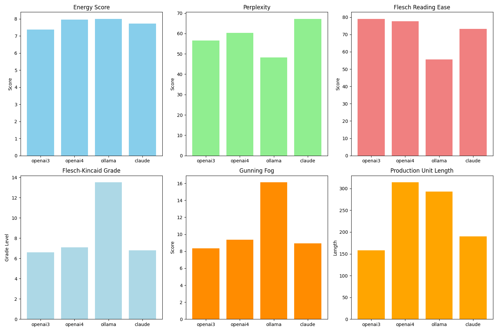

# llm-text-inspector
 Ways to analyse the different LLMs' text outputs

# Metrics Explained
**Energy**
- Definition: A measure of linguistic complexity based on word frequency and grammar structure.
- Interpretation: Lower scores indicate simpler, more common language usage, while higher scores suggest more complex and rarer language patterns.
- Usage: Useful for assessing how "natural" or "vibrant" a sentence sounds.

**Perplexity**
- Definition: A measurement of how well a language model predicts a text, indicating the model’s uncertainty.
- Interpretation: Lower scores indicate better predictions and coherent language, while higher scores suggest the opposite.
- Usage: Used to gauge the fluency and coherence of generated text.

**Flesch Reading Ease**
- Definition: A readability test that calculates how easy a text is to read based on sentence length and syllable count.
- Scale: 0 to 100, where higher scores mean easier reading.
- Interpretation: Scores below 50 are considered difficult to read, while scores above 60 are relatively easy.
- Usage: Ideal for evaluating the accessibility of a text.

**Flesch-Kincaid Grade**
- Definition: A readability test that converts the Flesch Reading Ease score to a U.S. grade level.
- Scale: Corresponds to U.S. school grade levels.
- Interpretation: A higher score means a more difficult text; for example, a score of 12 means the text is suitable for a 12th-grade student.
- Usage: Useful for aligning content with the intended audience's education level.

**Gunning Fog Index**
- Definition: A readability test that estimates the years of formal education needed to understand a text.
- Scale: Usually ranges from 6 to 20, where higher scores indicate more complex text.
Interpretation: A score of 12 corresponds to a high-school senior’s reading level.
- Usage: Effective for assessing the general readability of content.

**Production Unit Length (PUL)**
- Definition: Measures the structural complexity of a sentence based on grammatical production units.
- Interpretation: Longer lengths suggest more complex sentence structures, while shorter lengths indicate simpler sentences.
- Usage: Useful for analyzing sentence structure and linguistic richness.

## LLM Evaluation
Based on the image, which compares various metrics across four different LLMs (`openai3`, `openai4`, `ollama`, and `claude`), the following conclusions can be drawn about each LLM and what they might be good for:

1. **openai3**
   - **Energy Score**: The energy score for openai3 is lower compared to the other models. This suggests that the language used might be more straightforward or less vibrant.
   - **Perplexity**: openai3 has a relatively lower perplexity, indicating good coherence.
   - **Flesch Reading Ease**: The reading ease score is low, indicating that the text might be challenging to read.
   - **Flesch-Kincaid Grade**: The grade level is around 12, suitable for high-school readers.
   - **Gunning Fog**: The score indicates moderately complex text.
   - **Production Unit Length**: The length is relatively short, suggesting concise text.
   - **Conclusion**: openai3 is good for generating coherent, straightforward, and concise text, suitable for high-school-level readers.

2. **openai4**
   - **Energy Score**: The energy score for openai4 is relatively high, indicating vibrant language use.
   - **Perplexity**: The perplexity is highest among the models, suggesting less coherence.
   - **Flesch Reading Ease**: The reading ease score is low, making the text challenging.
   - **Flesch-Kincaid Grade**: The grade level is high, suitable for college-level readers.
   - **Gunning Fog**: The score is also high, indicating complex text.
   - **Production Unit Length**: The length is longer, suggesting more detailed text.
   - **Conclusion**: openai4 produces vibrant and detailed text but with higher complexity and less coherence, suitable for more advanced readers.

3. **ollama**
   - **Energy Score**: The energy score is high, similar to openai4.
   - **Perplexity**: The perplexity is lower than openai4, indicating better coherence.
   - **Flesch Reading Ease**: The reading ease score is low, making the text challenging.
   - **Flesch-Kincaid Grade**: The grade level is similar to openai4, suitable for college-level readers.
   - **Gunning Fog**: The score is lower than openai4, indicating less complex text.
   - **Production Unit Length**: The length is longer, similar to openai4.
   - **Conclusion**: ollama produces vibrant and detailed text with better coherence and less complexity compared to openai4, suitable for more advanced readers.

4. **claude**
   - **Energy Score**: The energy score for claude is the lowest, indicating straightforward language.
   - **Perplexity**: The perplexity is relatively low, suggesting good coherence.
   - **Flesch Reading Ease**: The reading ease score is highest, indicating easy-to-read text.
   - **Flesch-Kincaid Grade**: The grade level is lower, suitable for high-school readers.
   - **Gunning Fog**: The score indicates less complex text.
   - **Production Unit Length**: The length is longest, indicating detailed text.
   - **Conclusion**: claude is good for generating coherent, easy-to-read, and detailed text, suitable for a wide range of readers.

## Overall Conclusion

- `openai3` is suitable for concise and straightforward responses for high-school-level readers.
- `openai4` and `ollama` are better suited for vibrant, detailed, and complex text for more advanced readers.
- `claude` is ideal for clear, coherent, and detailed text, accessible to a broad audience.
